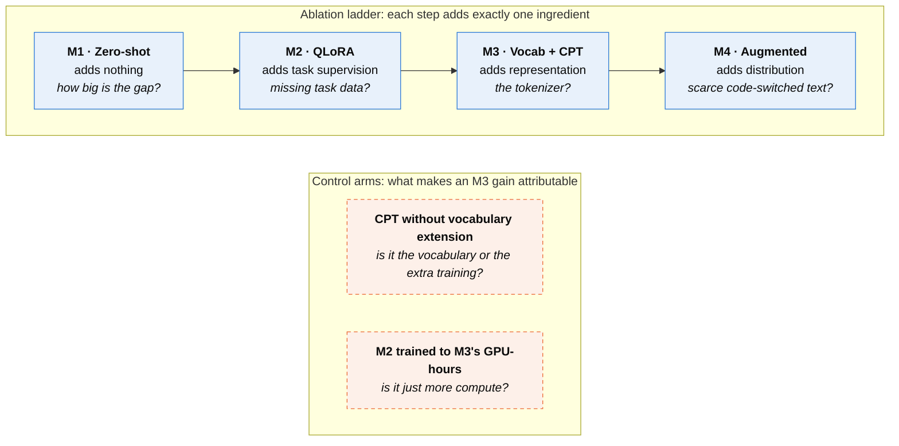
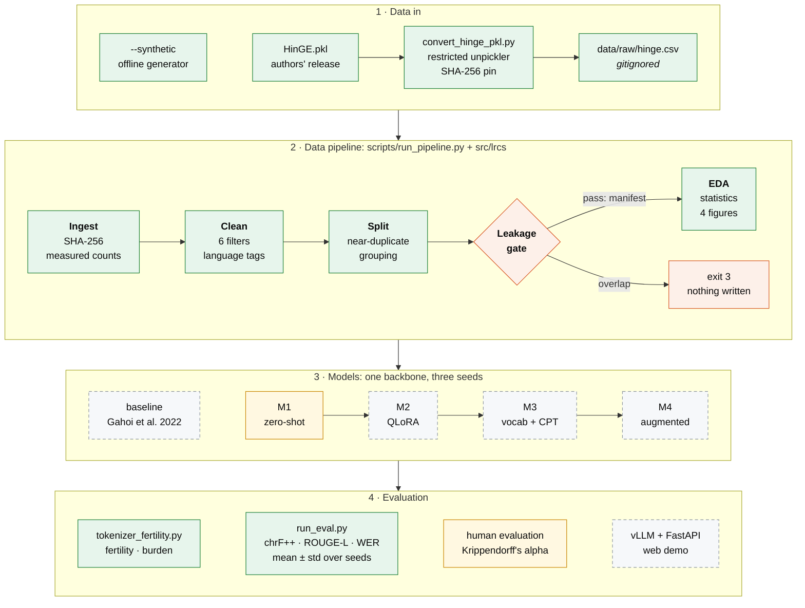
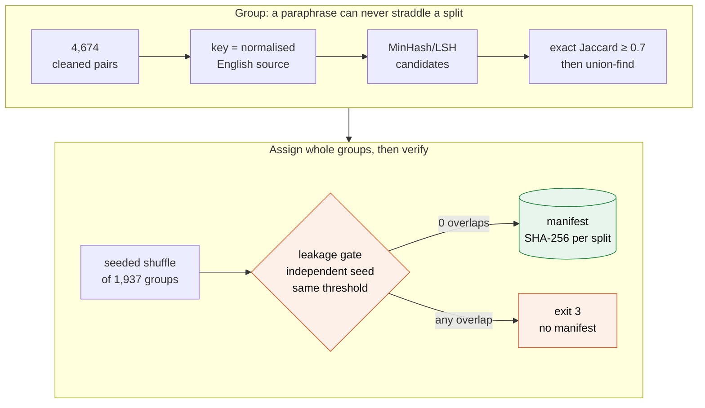
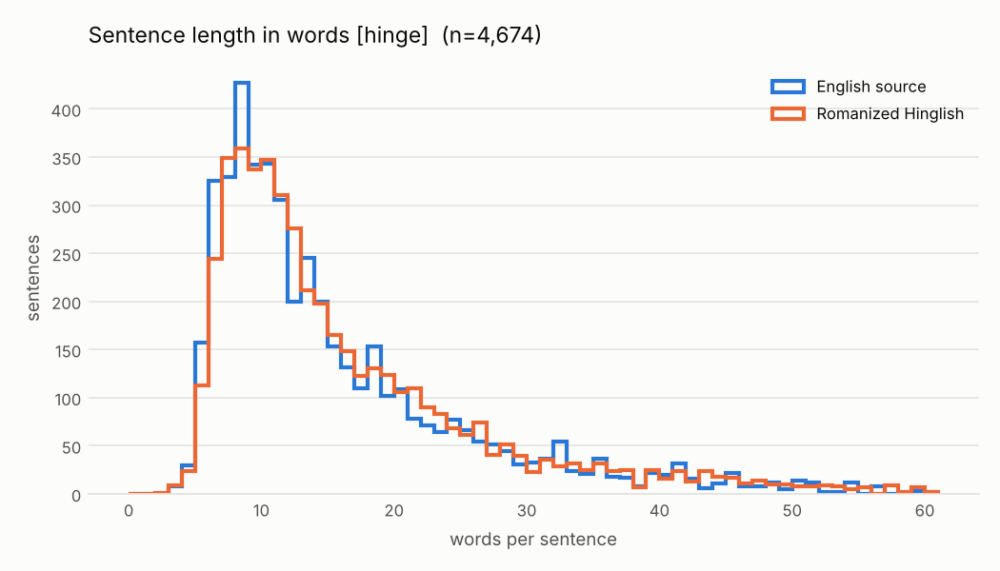
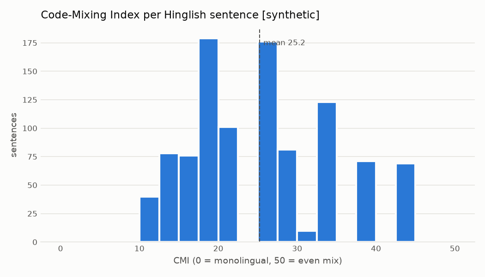
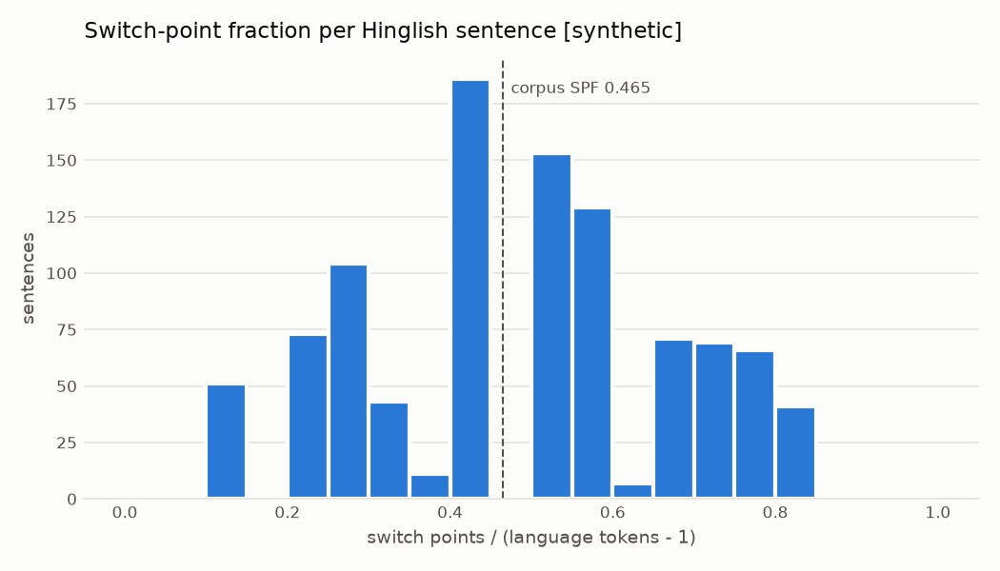
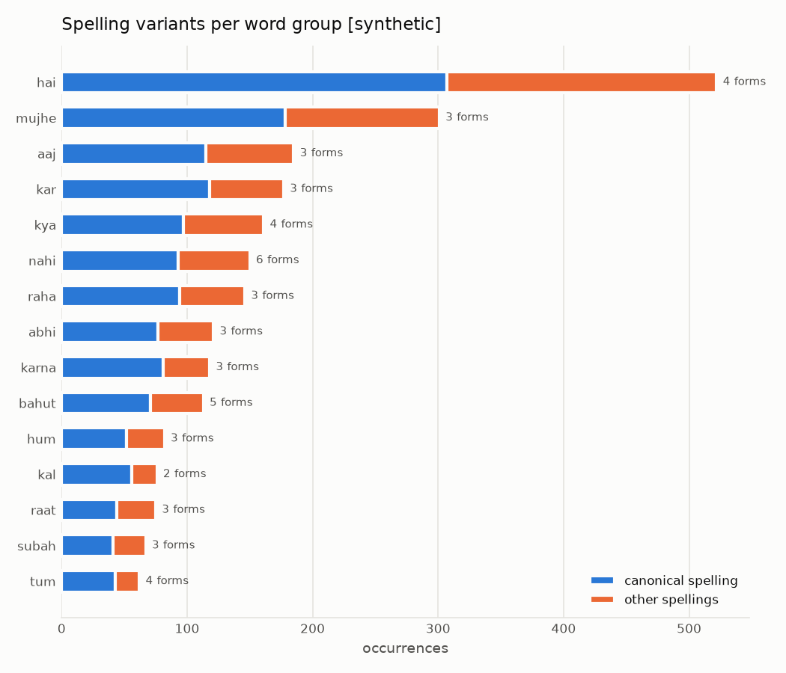
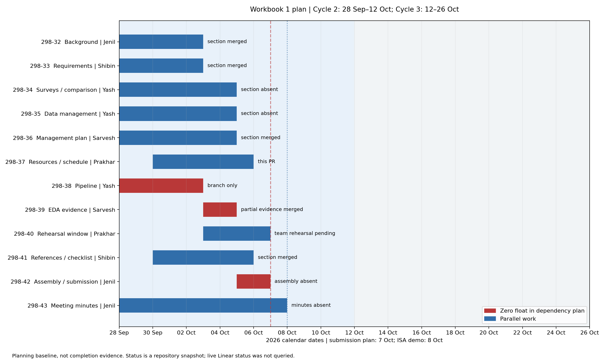
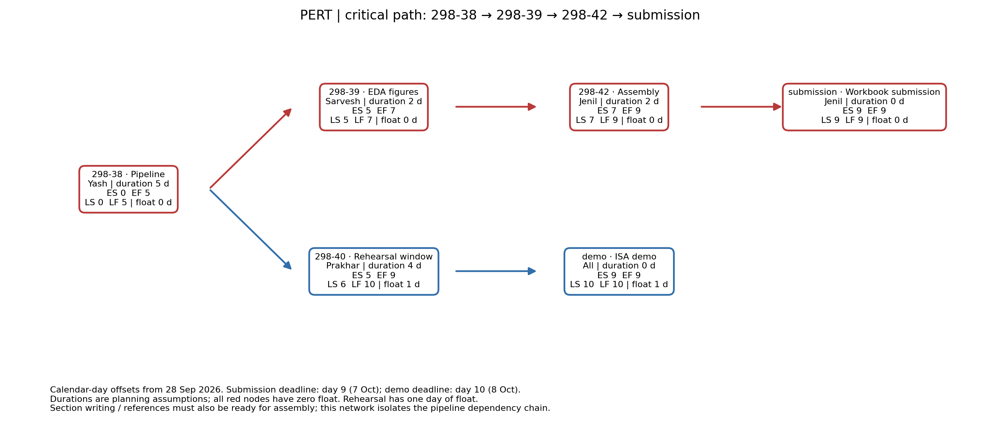

<div align="center">

# Low-Resource and Code-Switched Language Systems

### Hinglish is already written in the Latin alphabet — so why do language models still pay extra for it?

**We test one answer: spelling.** `nahi`, `nhi`, `nahin` and `nahii` are one word.
A tokenizer sees four.

<br/>


An adaptation and evaluation framework for Hindi–English code-switched generation<br/>
San José State University · Department of Applied Data Science · Team 2 · Section 11 · Topic 23

[The idea](#the-idea) · [Architecture](#architecture) · [Data pipeline](#the-data-pipeline) ·
[Findings](#what-the-real-corpus-shows) · [Evaluation](#evaluation-design) ·
[Quickstart](#quickstart) · [Status](#project-status) · [Team](#team)

</div>

---

## At a glance

Measured on the real HinGE corpus by `scripts/run_pipeline.py --input data/raw/hinge.csv --seed 42`
(commit `c65faec`, 8 Oct 2026). Every number below is in
[`reports/data_statistics.json`](reports/data_statistics.json).

| Measure | Result |
|---|---|
| **Corpus** | 1,976 English–Hindi source rows → **4,799** human Hinglish references, counted off the file (the paper reports 4,803; see [open issues](#known-gaps-and-open-questions)) |
| **After cleaning** | **4,674** pairs — six filters, 125 removals (2.6%), each charged to the filter that caught it |
| **Splits** | **3,738 / 468 / 468** train / dev / test over 1,938 unique sources, near-duplicates grouped |
| **Leakage gate** | **0** exact and **0** near-duplicate cross-split overlaps at character 4-gram Jaccard ≥ 0.7 |
| **Code-mixing** | **86.1%** of Hinglish sentences contain both languages · mean CMI **25.3** · switch-point fraction **0.240** |
| **Spelling variance** | **28** of the 68 lexicon word groups that occur appear in 2+ spellings · **12.9%** of their occurrences are non-canonical (a few groups merge homographs; see [open issues](#known-gaps-and-open-questions)) |
| **Tokenizer cost** | `spelling_variant_burden` = **1.832** tokens per surface form on `Qwen/Qwen2.5-7B-Instruct` (1.0 = no cost) |
| **Runtime** | The whole four-stage pipeline takes **12 s** on a laptop CPU |

---

## The idea

Quality loss on low-resource and code-switched text is usually blamed on **missing data**,
and tokenizer inefficiency is usually blamed on **non-Latin script**. Hinglish is already
written in Roman script, so if a tokenizer still pays extra for it, neither explanation covers
the gap.

Our claim is **orthographic variance**: written Hinglish has no standard spelling, so one word
reaches the model as several unrelated vocabulary entries, and the model has to learn each one
separately from very little data.

**One word, several tokenizer entries** — token costs on the `Qwen/Qwen2.5-7B-Instruct`
tokenizer ([`reports/spelling_variance.md`](reports/spelling_variance.md)):

| Word | Spellings → tokens each | What it shows |
|---|---|---|
| *nahi* (no) | `nhi` **1** · `nahi` **2** · `nahin` **2** | the same word costs different amounts depending on who typed it |
| *acha* (good) | `acha` **1** · `accha` **2** · `achha` **2** | the cost is uneven inside one word group |
| *theek* (okay) | `theek` **2** · `thik` **2** · `thk` **2** | three entries for one meaning, two tokens each |

**And the variants are really in the data** — counts from the 4,674 cleaned HinGE pairs:

| Word | Observed spellings (count) | Non-canonical share |
|---|---|---:|
| *kuch* (some) | `kuch` 62 · `kuchh` 35 · `kucch` 1 | **36.7%** |
| *gaya* (went) | `gaya` 111 · `gya` 14 | **11.2%** |
| *nahi* (no) | `nahi` 299 · `nhi` 38 | **11.3%** |
| *karna* (to do) | `karna` 80 · `krna` 5 | **5.9%** |
| *kar* (do) | `kar` 215 · `kr` 11 | **4.9%** |

The dominant pattern is **vowel deletion** (`nhi`, `gya`, `krna`, `kr`), plus an optional
aspirate (`kuchh`). Across the 4,674 pairs, the Hinglish side uses **13,204** distinct word
types against **6,780** on the English side, at almost the same token count (74,165 vs 71,217).
Several human references per source each spell words their own way, and Hindi morphology also
adds types — so this is motivation, not the measurement. The measurement is the burden metric
above, plus the controlled experiment below.

### Three explanations, four models

Each model adds exactly one ingredient, so each step isolates one competing explanation.



All four share **one backbone**, the same token and step budget, and three seeds
(13, 42, 1337). The two control arms are what make an M3 gain attributable: without them,
"M3 wins" could just mean "M3 trained longer".

> **A null result is pre-committed to.** Success is **+3 chrF++** over zero-shot with
> non-overlapping error bars across the three seeds. Under **1 chrF++**, or overlapping bars,
> is published as a null result. A controlled ablation that rules an explanation out is itself
> a finding.

---

## Architecture

Green boxes are built and on `main`, amber ones are partly built, and dashed grey ones are
designed but not built yet.



| Layer | Where | What it guarantees |
|---|---|---|
| Conversion | [`scripts/convert_hinge_pkl.py`](scripts/convert_hinge_pkl.py) | The only place a pickle is opened: pandas/numpy classes only, and `--expected-sha256` refuses a substituted file |
| Pipeline | [`scripts/run_pipeline.py`](scripts/run_pipeline.py), [`src/lrcs/`](src/lrcs) | Measured counts, itemised attrition, leak-free reproducible splits, statistics and figures — standard library plus matplotlib |
| Tokenizer analysis | [`analysis/tokenizer_fertility.py`](analysis/tokenizer_fertility.py) | Fertility, bytes per token, continuation rate, vocabulary coverage and `spelling_variant_burden`, with no GPU |
| Evaluation | [`evaluation/run_eval.py`](evaluation/run_eval.py) | One command to a scored run; refuses misaligned files; mean ± std across seeds; `--check-baseline` |
| Human evaluation | [`human_eval/`](human_eval) | Krippendorff's alpha per dimension; 50-item pilot inputs and rubric |
| Reproducibility | [`common/repro.py`](common/repro.py) | One seeding function for everything; one JSON per run with commit, packages and GPU-hours |

---

## The data pipeline

One command, four stages, **12 seconds** on the real corpus:

```bash
python scripts/run_pipeline.py --input data/raw/hinge.csv --seed 42
```

### Stage 1 · Ingest — measured, never quoted

Path, file timestamp, byte count, SHA-256, rows in the file, and references after expanding
HinGE's list-valued cells — all **read off the file**. The released CSV hashes to
`dcfaf37c…c9c3` and yields 1,976 rows and 4,799 references. Pickles are refused at this
stage, because unpickling a downloaded file can run code.

### Stage 2 · Clean — every removal accounted for

Each record is charged to the **first** filter that rejects it, so the table adds up exactly.

| Filter | Catches | In | Removed | Out |
|---|---|---:|---:|---:|
| `missing_field` | empty English or Hinglish | 4,799 | 0 | 4,799 |
| `not_romanized` | Devanagari in the Hinglish column | 4,799 | **25** | 4,774 |
| `untranslated` | English copied through as "Hinglish" | 4,774 | 0 | 4,774 |
| `length_bounds` | under 2 or over 60 words | 4,774 | **87** | 4,687 |
| `length_ratio` | Hinglish/English length outside ⅓–3× (misaligned pairs) | 4,687 | **11** | 4,676 |
| `exact_duplicate` | the same pair twice | 4,676 | **2** | **4,674** |

Every surviving token gets a LinCE-style language tag (`lang1` English, `lang2` Hindi,
`ambiguous`, `ne`, `other`, `unk`) from a documented rule-based marker list; a learned
language-ID model for Romanized Hinglish is out of scope. A token copied from the pair's own
English source counts as English, which catches switched-in words such as *meeting* or
*market*. The tagger resolves **68.2%** of word tokens, and that coverage is reported next to
every code-mixing number.

### Stage 3 · Split — and a gate that halts

HinGE's downstream released train/dev splits are **not disjoint**: the audit recorded in
[`docs/datasheet.md`](docs/datasheet.md) found **285 of dev's 376** unique English sources
(**75.8%**) also in train. We never use them.



- **All references of one source stay together.** HinGE averages 2.41 human references per
  source; splitting them up would put the same sentence in both train and test.
- **Paraphrases cannot straddle a boundary.** Candidates come from LSH, but every candidate is
  verified by exact Jaccard, so LSH can only miss a pair, never wrongly merge one.
- **One threshold, both sides.** `--dup-threshold` drives dedupe *and* the gate. With two
  separate values, pairs between them would pass dedupe as "different" and then fail the gate
  as "leaked" on clean data.
- **The gate re-hashes with an independent seed**, so a pair that LSH missed during dedupe
  gets a second, independent chance to be caught.
- **A leak stops the run.** Exit code 3, and no manifest is written. A degenerate split, where
  one near-duplicate group holds over 5% of the records, also halts, with exit code 4.

The gate at work, from the [rehearsal record](reports/rehearsals/2026-10-07/leakage-gate.log)
(`--inject-leak` deliberately copies a test source into train on synthetic data):

```text
leakage gate HALTED: 839 sources checked at Jaccard >= 0.7 -- 1 exact, 1 near-duplicate overlaps
  exact: 'the bike at the hotel was really confusing'
  near (0.73): 'the bike at the hotel was really confusing' ~ 'the book at the hotel was really confusing'

HALTED: leakage gate: 1 exact and 1 near-duplicate source(s) shared across splits. No manifest written.
```

The committed HinGE split,
[`hinge_split_manifest.json`](data/processed/manifests/hinge_split_manifest.json):

| Split | Records | Unique sources | SHA-256 of the split file |
|---|---:|---:|---|
| train | 3,738 | 1,549 | `82c045f2…bc1eed5` |
| dev | 468 | 192 | `db0b17cc…e3c68a` |
| test | 468 | 197 | `6ac5d302…c14478` |

### Stage 4 · EDA — statistics and four figures

Stage 4 writes [`reports/data_statistics.json`](reports/data_statistics.json) and the four
figures below. Every figure title carries the data source, so a synthetic run can never be
mistaken for a HinGE run.

---

## What the real corpus shows

<table>
<tr>
<td width="50%" valign="top"><br/><sub><b>Sentence length.</b> Hinglish tracks its English source closely: mean 15.9 vs 15.2 words, both medians 12.</sub></td>
<td width="50%" valign="top"><br/><sub><b>Code-Mixing Index.</b> Mean 25.3 over all sentences and 29.4 over mixed ones; 86.1% are mixed.</sub></td>
</tr>
<tr>
<td width="50%" valign="top"><br/><sub><b>Switch-point fraction.</b> Corpus SPF 0.240: roughly one switch every four adjacent language tokens. This number will set M4's synthetic sampling.</sub></td>
<td width="50%" valign="top"><br/><sub><b>Spelling variants.</b> Canonical vs other spellings for the 15 most frequent lexicon groups.</sub></td>
</tr>
</table>

| Code-mixing statistic | Value | Reading |
|---|---:|---|
| Sentences containing both languages | **86.1%** | most HinGE references are genuinely code-switched |
| CMI, all / mixed only | **25.3 / 29.4** | 0 is monolingual and 50 an even mix |
| English share of tagged language tokens | **71.3%** | 35,618 English vs 14,344 Hindi tags |
| Switch-point fraction | **0.240** | switches happen inside clauses, not only between them |
| M-index | **0.693** | 0 is monolingual and 1 perfectly balanced |
| Burstiness | **0.056** | close to 0: switching is neither clustered nor regularly alternating |
| Mean monolingual run | **3.2** tokens | runs are short phrases, not whole clauses |
| Tagger coverage | **68.2%** | the rest (mostly `unk`) is excluded from every statistic above |

All code-mixing statistics are computed over the tokens the marker list could resolve. The
marker list knows English better than Hindi (any word copied from the source counts as
English), so the English share is likely overstated, and the 31.8% of unresolved tokens is the
reason to read these numbers as a first characterisation, not a final one.

### Tokenizer evidence

| Measure | English | Romanized Hinglish |
|---|---:|---:|
| Fertility (tokens per word) | 1.024 | **1.501** |
| Continuation rate (words split into 2+ pieces) | 0.024 | **0.449** |
| Single-token vocabulary coverage | 0.985 | **0.526** |

Measured on `Qwen/Qwen2.5-7B-Instruct` over a **1,091-pair synthetic slice shaped like
HinGE**, not the real corpus, so treat these as indicative: re-measuring on real HinGE slices
is open work. `spelling_variant_burden = 1.832` does **not** depend on a corpus. It is a
property of the tokenizer and the 72-group lexicon, and it is a **lower bound**, because the
corpus contains variants the lexicon does not list yet (`bhut` and `bohot` for *bahut*). The
cost concentrates in longer Hindi-specific words: `shukriya` 3.33, `chahiye` 2.75 and `kitna`
2.67 mean tokens per spelling.

---

## Evaluation design

Metrics were fixed **in writing before any result was produced**, and are not changed afterwards.

| Metric | Scale | Role | Why |
|---|---|---|---|
| **chrF++** | 0–100 | **primary** | character n-grams plus word bigrams; tolerant of Romanized spelling variation in a way BLEU is not |
| chrF++ (normalised) | 0–100 | secondary | chrF++ after collapsing spelling variants; **the raw-vs-normalised gap is itself evidence of orthographic instability** |
| BLEU | 0–100 | secondary | comparability only; expected to be pessimistic here |
| ROUGE-L | 0–1 | secondary | to compare against Gahoi et al. (2022), Table 2 |
| WER | 0–1 | secondary | same reason |
| Code-switching penalty | chrF++ points | secondary | the same English source scored against a monolingual Hindi reference and a Hinglish reference; the difference is the cost of code-switching |

- **Seeds:** every number is mean ± std over seeds **13, 42, 1337**.
- **Perplexity:** per **byte**, never per token. Per-token perplexity cannot compare M2 with
  M3, because M3 changes the vocabulary.
- **COMET is deliberately excluded for now:** its coverage of Romanized Hinglish is uncertain,
  and that is reported as a limitation rather than relied on quietly.
- **Human evaluation:** three trained bilingual raters plus one external rater on a shared
  subset, blinded and shuffled per item. They rate adequacy, fluency and **code-switching
  naturalness**, a dimension standard MT protocols lack. Krippendorff's alpha is reported per
  dimension. *Declared conflict of interest:* the team writes the evaluation set and also rates
  outputs. Blinding, shuffling and the external rater mitigate this, and internal and external
  agreement are reported separately.

### Reproduced baseline

Gahoi et al. (2022), *Gui at MixMT 2022* — **Table 2, MixMT Subtask-1: ROUGE-L 0.617,
WER 0.633** on the 500-sentence test set: mBART fine-tuned on English + Hindi input, then
transliterated to Roman script. **Code obtained: no** — the recipe is re-implemented from the
paper. The target is ROUGE-L within **0.01**, enforced by `--check-baseline`. It runs twice:
as published (English + Hindi input), and English-only, which is our comparable reference.
**No model result is interpreted until this lands within tolerance**, because its job is to
prove the harness is correct.

---

## Engineering guarantees

| Guarantee | How it is enforced | Evidence |
|---|---|---|
| Counts are measured, never quoted | Stage 1 counts the file it was handed | 4,799, not the published 4,803, in `data_statistics.json` |
| Splits cannot leak | Grouped near-duplicates, one shared threshold, a gate that **halts** | 0 / 0 overlaps on HinGE; exit 3 in the leakage drill |
| Splits are reproducible | Content-hash record IDs, sorted keys, seeded shuffle, deterministic union-find | Two fresh clones gave identical input and split hashes ([rehearsal](reports/rehearsals/2026-10-07/README.md)) |
| Downloads cannot run code | `ingest` refuses pickles; the converter allows pandas/numpy classes only and pins the SHA-256 | [`tests/test_convert_hinge_pkl.py`](tests/test_convert_hinge_pkl.py) |
| No data in Git | `data/raw/`, `data/interim/` and `data/processed/` gitignored; only hashed manifests are committed | [`.gitignore`](.gitignore) |
| Every run is on record | `RunLogger` writes seed, config, metrics, commit, packages and GPU-hours; CPU jobs log `n_gpus=0` | [`runs/`](runs) |
| Runs on the demo laptop | The pipeline needs only the standard library plus matplotlib, and avoids 3.10-only syntax | Verified on Python 3.9.6 and 3.14 (PR #18) |
| Changes are tested | `python -m pytest tests/` | **24 passed, 1 skipped** on `main` at `c3e884a` |

---

## Quickstart

```bash
git clone https://github.com/298A-Team-2-Topic-23/Low-Resource-and-Code-Switched-Language-Systems.git
cd Low-Resource-and-Code-Switched-Language-Systems
python3 -m venv .venv && source .venv/bin/activate
pip install -r requirements-demo.txt          # CPU subset: pipeline, evaluation, tests
# pip install -r requirements.txt             # full training stack (torch, transformers, peft, ...)
```

**Verify the install** — no GPU, no model download, no dataset:

```bash
python -m pytest tests/ -q
python common/repro.py --selftest
python analysis/tokenizer_fertility.py --selftest
```

**Run the pipeline offline** on synthetic data, in about 2 seconds. Every output says
`synthetic`:

```bash
python scripts/run_pipeline.py --synthetic --n-synthetic 1200 --seed 42
```

**Run it on the real corpus.** Get `HinGE.pkl` from the authors (the link is in
[`docs/datasheet.md`](docs/datasheet.md)) and put it in `data/raw/`:

```bash
python scripts/convert_hinge_pkl.py data/raw/HinGE.pkl data/raw/hinge.csv \
  --expected-sha256 e78c8f48af3eea0b141e767082189b7b619e9cbe50ad8f0b2a4863b82ebc5960
python scripts/run_pipeline.py --input data/raw/hinge.csv --seed 42
```

Or walk through it stage by stage in
[`notebooks/tm1_data_pipeline_demo.ipynb`](notebooks/tm1_data_pipeline_demo.ipynb), which is
committed with the outputs of the real-corpus run.

<details>
<summary><b>Scoring a run with the evaluation harness</b></summary>

Hypotheses and references are plain text, one sentence per line, aligned by line number. A
line-count mismatch exits with an error instead of producing a quietly wrong score.

```bash
# single system
python evaluation/run_eval.py --hyp out/m1.0shot.txt --ref data/test.hinglish.txt --system "Model 1 zero-shot"

# three seeds -> mean ± std, appended to a results file
python evaluation/run_eval.py --hyp out/m2.s1.txt out/m2.s2.txt out/m2.s3.txt \
  --ref data/test.hinglish.txt --system "Model 2 QLoRA" --out results/results.jsonl

# the comparison table for the report
python evaluation/run_eval.py --report results/results.jsonl

# check a baseline reproduction against Gahoi et al. (2022), Table 2
python evaluation/run_eval.py --hyp out/gahoi_repro.txt --ref data/mixmt.test.ref.txt \
  --system "Gahoi et al. repro" --check-baseline
```

A smoke test over five bundled demo sentences (the numbers are meaningless by design):

```bash
python evaluation/run_eval.py --hyp evaluation/demo/hyp.seed1.txt evaluation/demo/hyp.seed2.txt \
  --ref evaluation/demo/ref.hinglish.txt --system "smoke test"
```
</details>

<details>
<summary><b>Tokenizer fertility on a candidate backbone</b></summary>

```bash
python analysis/tokenizer_fertility.py \
    --corpus en=data/slices/en.txt \
    --corpus hinglish=data/slices/hinglish.txt \
    --tokenizer Qwen/Qwen2.5-7B-Instruct \
    --out reports/fertility.csv
```

`--cmi-only --conll <file>` computes the code-mixing statistics on a language-tagged corpus.
Metric definitions and expected ranges are in [`analysis/README.md`](analysis/README.md).
</details>

<details>
<summary><b>Pipeline options</b></summary>

| Flag | Default | Meaning |
|---|---|---|
| `--input PATH` / `--synthetic` | — | a CSV/TSV with English and Hinglish columns, or the offline generator |
| `--seed` | 42 | seeds generation, grouping hashes and split assignment |
| `--dup-threshold` | 0.7 | character 4-gram Jaccard at which two sources count as the same; shared by dedupe **and** the gate |
| `--ratios` | 0.8 0.1 0.1 | train / dev / test share of records |
| `--max-group-frac` | 0.05 | halt if one near-duplicate group exceeds this share of the records |
| `--inject-leak K` | 0 | **demo only**: copy K test sources into train to show the gate halting |
| `--no-figures`, `--no-run-log` | off | statistics only; skip the `runs/` record |

Exit codes: `0` ok · `2` bad input · `3` leakage gate halted · `4` degenerate split.
</details>

---

## Repository map

```text
├── scripts/
│   ├── run_pipeline.py          one command, four stages
│   ├── convert_hinge_pkl.py     the only place a pickle is opened (restricted, hash-pinned)
│   └── charts.py                regenerates the Gantt and PERT charts
├── src/lrcs/                    the pipeline package
│   ├── data/                    ingest · synthetic · clean · splits · leakage
│   ├── analysis/                codemixing (CMI, SPF, M-index, burstiness) · eda (stats + figures)
│   └── lexicon.py, text.py      one lexicon loader and one tokeniser shared by every stage
├── analysis/                    tokenizer fertility + the 72-group spelling-variant lexicon
├── evaluation/                  the scoring harness and its demo fixtures
├── human_eval/                  Krippendorff's alpha, the 50-item pilot, rubric
├── models/                      generation scripts (M1 zero-shot)
├── common/repro.py              seeding + run logging, imported by every script that runs anything
├── data/
│   ├── goldtestset/             three-column gold-set schema, guidelines, validator
│   └── processed/manifests/     committed split manifests (HinGE + synthetic fallback)
├── reports/                     data_statistics.json, figures, spelling-variance evidence, rehearsals
├── notebooks/                   the stage-by-stage demo notebook, with real-corpus outputs
├── runs/                        one JSON per run — the compute evidence
├── docs/                        datasheet, project management plan, Workbook 1 sections
└── tests/                       the pytest suite
```

---

## Project status

| Component | Status | Evidence |
|---|---|---|
| Data pipeline, four stages + leakage gate | **Done** · run on the real corpus | PRs #18 and #21 · [`data_statistics.json`](reports/data_statistics.json) |
| HinGE train / dev / test splits | **Done** · gate passed | [`hinge_split_manifest.json`](data/processed/manifests/hinge_split_manifest.json) |
| Datasheet and licence review | **Done** · HinGE licence still unresolved | [`docs/datasheet.md`](docs/datasheet.md) |
| Tokenizer fertility and burden | **Done** on a synthetic slice · real-slice re-run open | [`reports/spelling_variance.md`](reports/spelling_variance.md) |
| Evaluation harness | **Done** · bootstrap significance not built yet | [`evaluation/run_eval.py`](evaluation/run_eval.py) |
| Human-evaluation tooling and pilot inputs | **Done** · pilot scoring pending | [`human_eval/`](human_eval) |
| Gold evaluation set (800 items) | Schema, guidelines and validator · **0 of 800 items written** | [`data/goldtestset/`](data/goldtestset) |
| M1 zero-shot | Script exists · **no scored run yet** | [`models/generate_zeroshot.py`](models/generate_zeroshot.py) |
| Baseline reproduction | Not run | — |
| M2 QLoRA | Not started | — |
| M3, M4, serving and web interface | Planned for 298B | — |

**Compute:** 80–145 GPU-hours are committed in the abstract, with 130 as the working allocation
([§2.3](docs/workbook1/section_2_3_2_4.md)), on single 40GB-class GPUs, one job per GPU. No
training run is logged yet; `python common/repro.py --summary runs/` prints the running total.

**Schedule:** Workbook 1 sits in Cycle 2 (28 Sep–12 Oct 2026), and its critical path runs
pipeline → EDA → assembly → submission.

<details>
<summary><b>Gantt and PERT charts</b></summary>




Regenerate with `pip install -r requirements-charts.txt && python scripts/charts.py`.
</details>

---

## Known gaps and open questions

Written down here rather than fixed silently, because each one affects a number that would
otherwise reach a report unchallenged.

- **HinGE reference count: 4,799 measured vs 4,803 published.** Four apart. It needs a second
  person to re-count from Table 1 of the paper.
- **HinGE has no stated licence.** It is treated as CC-BY-NC-4.0-equivalent, because its source
  pairs come from the IIT Bombay corpus.
- **The M1 script and the measured backbone disagree.** §1.4 adopts
  `Qwen/Qwen2.5-7B-Instruct`, the tokenizer the fertility numbers were measured on.
  `models/generate_zeroshot.py` still defaults to `Qwen/Qwen3-8B` without
  `enable_thinking=False`, and Qwen3 reasons by default. This has to be fixed before any M1 run.
- **Fertility has not been measured on the real corpus yet.** The 1.501 vs 1.024 comparison
  comes from a synthetic slice; the real HinGE splits now exist, so the real slices are next.
- **The variant lexicon merges some different words.** `kaha` ("said") sits in the *kahan*
  ("where") group, plural `hain` in *hai*, informal `tu` in *tum*, `nai` ("new") in *nahi*,
  and `fir` may be the police "FIR" as well as *phir*. This inflates those groups'
  non-canonical share, which is why this README quotes only unambiguous groups. The v2 lexicon
  should split homographs and add variants harvested from the train split (`bhut`, `bohot`).
- **Normalised chrF++ is near-inert.** The current regex normalisation fully collapses only
  3 of the 72 lexicon groups. The dominant Hinglish pattern is vowel *deletion* (`nhi`, `kr`,
  `gya`), which vowel-lengthening rules cannot catch. No normalised number is reported until
  lexicon-based normalisation replaces it.
- **Bootstrap significance (1,000 resamples) is specified but not implemented** in
  `run_eval.py`.
- **The gold set is empty.** Authoring waits on the 50-item pilot's agreement result.

---

## Team

| Member | Primary area |
|---|---|
| Savalia, Jenil Sanjaybhai | data pipeline, annotation, gold set |
| Shevkar, Yash | data sources, licences, splits |
| Singh, Prakhar Kumar | infrastructure, reproducibility, schedule, demo |
| Thomas Lnu, Shibin Biji | evaluation harness, baseline reproduction, real-corpus run |
| Waghmare, Sarvesh | modelling, tokenizer analysis, project management |

### How we work

**Linear issue → branch named with the issue ID → commits under the author's own GitHub
identity → PR → independent review → merge → issue Done with the artifact linked.**

- Branch `<name>/<ISSUE-ID>-<slug>`, commit `Refs 298-13: what you did`, PR body `Closes 298-13`.
- Nobody approves their own PR.
- Nothing is Done without a linked artifact: a PR, commit, dataset version, run log or report.
- **Never commit data. Seed everything.** The headline result depends on non-overlapping error
  bars across three seeds, so an unseeded run makes it unprovable.

---

## References

Barnett, R., Codó, E., Eppler, E., Forcadell, M., Gardner-Chloros, P., van Hout, R., Moyer, M.,
Torras, M. C., Turell, M. T., Sebba, M., Starren, M., & Wensing, S. (2000). The LIDES coding
manual. *International Journal of Bilingualism, 4*(2), 131–270.

Das, A., & Gambäck, B. (2014). Identifying languages at the word level in code-mixed Indian
social media text. *Proceedings of ICON 2014*, 378–387.

Dettmers, T., Pagnoni, A., Holtzman, A., & Zettlemoyer, L. (2023). QLoRA: Efficient finetuning
of quantized LLMs. *Advances in Neural Information Processing Systems 36*.

Gahoi, A., Duneja, J., Padhi, A., Mangale, S., Rajput, S., Kamble, T., Sharma, D., & Varma, V.
(2022). Gui at MixMT 2022: English-Hinglish — An MT approach for translation of code mixed data.
*Proceedings of the Seventh Conference on Machine Translation (WMT)*, 1126–1130.

Goh, K.-I., & Barabási, A.-L. (2008). Burstiness and memory in complex systems. *EPL, 81*(4),
48002.

Hu, E. J., Shen, Y., Wallis, P., Allen-Zhu, Z., Li, Y., Wang, S., Wang, L., & Chen, W. (2022).
LoRA: Low-rank adaptation of large language models. *ICLR 2022*.

Krippendorff, K. (2011). *Computing Krippendorff's alpha-reliability.* Annenberg School for
Communication, University of Pennsylvania.

Popović, M. (2017). chrF++: Words helping character n-grams. *Proceedings of the Second
Conference on Machine Translation (WMT)*, 612–618.

Rei, R., Stewart, C., Farinha, A. C., & Lavie, A. (2020). COMET: A neural framework for MT
evaluation. *Proceedings of EMNLP 2020*, 2685–2702.

Srivastava, V., & Singh, M. (2021). HinGE: A dataset for generation and evaluation of
code-mixed Hinglish text. *Proceedings of the 2nd Workshop on Evaluation and Comparison of NLP
Systems (Eval4NLP)*, 200–208.

The full list, submission checklist and self-assessment are in
[`docs/workbook1/references_and_checklist.md`](docs/workbook1/references_and_checklist.md).
